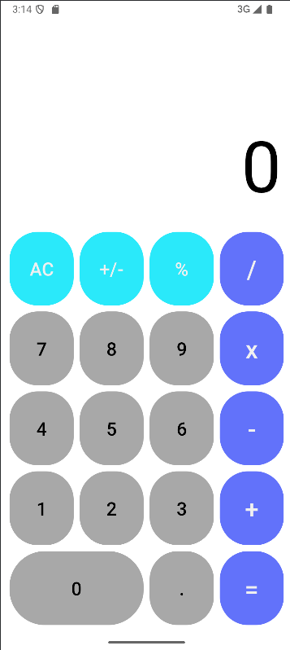

# Android Calculator App

## Overview

A feature-rich calculator application for Android that intelligently handles device orientation changes. The app showcases effective use of Android Intents for communication between different layouts in portrait and landscape modes.




## Features

- **Dual-Mode Interface**: 
  - Portrait mode: Standard calculator layout
  - Landscape mode: Scientific calculator with advanced functions

- **Seamless State Preservation**: 
  - Maintains calculation state when rotating the device
  - Uses Intents to communicate between different activity layouts

- **Calculation Features**:
  - Basic operations: addition, subtraction, multiplication, division
  - Advanced operations (landscape): trigonometric functions, logarithms, exponents, etc.
  - Memory functions: store and recall values

- **Modern UI**:
  - Material Design components
  - Responsive layout that adapts to different screen sizes
  - Smooth animations and transitions

## Technical Implementation

### Orientation Handling

This calculator takes a unique approach to handling orientation changes:

1. **Intent-Based Communication**:
   - When the device orientation changes, the current state (input values, operation in progress, etc.) is passed via an Intent to the appropriate layout activity.
   - This approach allows completely different UI layouts for portrait and landscape modes while maintaining calculation continuity.

2. **Activity Structure**:
   - `MainActivity`: Handles portrait mode calculator
   - `LandscapeActivity`: Displays scientific calculator in landscape mode

3. **State Preservation**:
   - Current input value
   - Operation history
   - Pending operations
   - Memory values

### Key Components

- `Intent` for inter-activity communication
- `android:configChanges` for managing orientation changes
- Custom `CalculatorEngine` class for performing calculations
- Shared Preferences for persistent storage of calculator memory

## Project Structure

```
app/
├── src/
│   ├── main/
│   │   ├── java/com/example/calculator/
│   │   │   ├── MainActivity.java
│   │   │   ├── LandscapeActivity.java
│   │   │   ├── CalculatorEngine.java
│   │   │   └── Utils.java
│   │   │
│   │   └── res/
│   │       ├── layout/
│   │       │   ├── activity_main.xml
│   │       │   └── activity_landscape.xml
│   │       ├── values/
│   │       │   ├── strings.xml
│   │       │   ├── colors.xml
│   │       │   └── styles.xml
│   │       └── drawable/
│   │
│   └── test/
└── build.gradle
```

## Setup Instructions

1. Clone the repository:
   ```
   git clone https://github.com/yourusername/calculator-app.git
   ```

2. Open the project in Android Studio.

3. Build and run the application on an emulator or physical device.

## Requirements

- Android Studio 4.0 or higher
- Minimum SDK: API 21 (Android 5.0 Lollipop)
- Target SDK: API 33 (Android 13)

## Future Enhancements

- Theme customization (dark mode, light mode, custom colors)
- History of calculations
- Programmable functions
- Graph plotting capabilities in landscape mode
- Unit conversion tools

## License

This project is licensed under the MIT License - see the LICENSE file for details.

## Acknowledgments

- Android documentation for Intent and orientation handling
- Material Design guidelines for UI components
